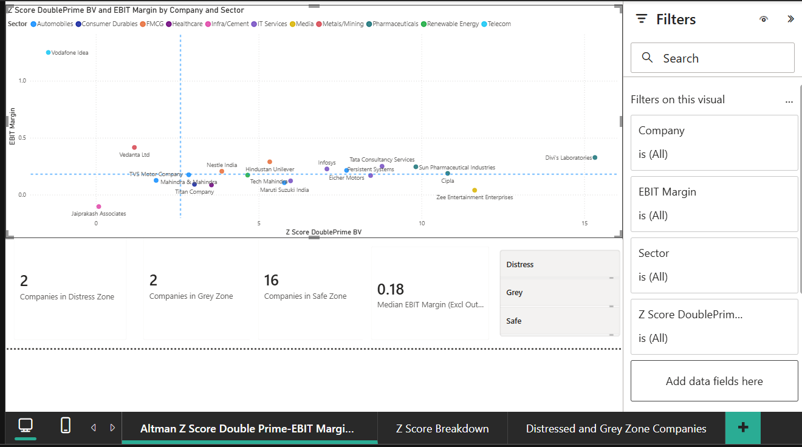
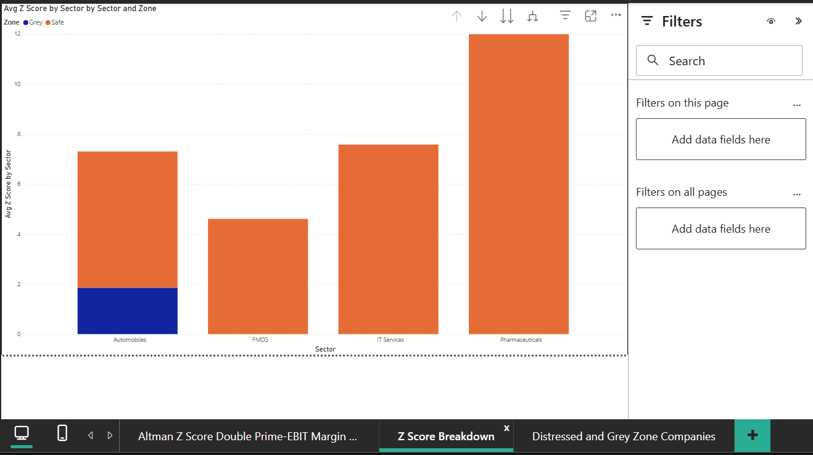
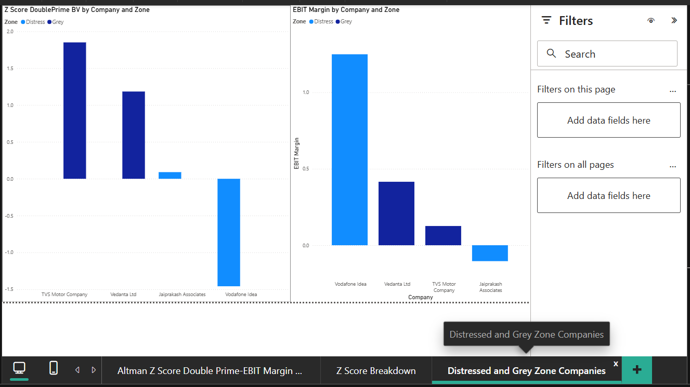

# Altman Z″-Score Analysis — Nifty Growth Sector

## Project Summary
A Power BI dashboard applying the Altman Z″-Score (bankruptcy/distress risk
model) to 20 Indian listed companies — 15 Nifty large-caps across IT, FMCG,
auto, pharma, and healthcare, plus 5 companies with real financial stress
added for contrast (including one currently in insolvency proceedings).

---

 Z″-Score & EBIT Margin Quadrant

Scatter plot: every company's EBIT Margin vs. Z″-Score.

- **Vertical line (Z″ = 2.6):** the Safe-zone threshold
- **Horizontal line (0.18):** median EBIT margin across all 20 companies

**Top-right** = strong margins + safe balance sheet (Divi's, TCS).
**Top-left** = profitable but more leveraged (Vedanta).
**Bottom-left** = weak on both (Jaiprakash Associates).

**Outlier:** Vodafone Idea shows an EBIT margin over 100% — not a real
operating result. It's a one-time ~₹57,595 Cr AGR-related gain in Q4 FY26.
Its actual day-to-day operations are still loss-making.

Sector Comparison

Average Z″-Score by sector, colored by Safe/Grey/Distress mix. **Filtered to
only IT Services, Automobiles, FMCG, and Pharmaceuticals** — the four
sectors with more than one company. The other 7 sectors have exactly one
company each, so their "average" would just be that single company's score,
not a real comparison.

**Takeaway:** IT Services and Pharma score consistently high (low leverage,
stable earnings). Automobiles has the widest spread.

 Distress & Grey Zone Drill-Down

Two side-by-side charts, showing only the 4 flagged companies (Jaiprakash
Associates, Vodafone Idea, TVS Motor, Vedanta) — Z″-Score on the left, EBIT
Margin on the right — so it's easy to see *why* each one was flagged without
hunting through the full 20-company chart.

**Validation:** Jaiprakash Associates (currently under NCLT insolvency
proceedings, being delisted June 2026) and Vodafone Idea (negative net worth
for years) are the two companies the model flags hardest. Both are real,
independently known distress cases — the model catching them using only
public balance sheet ratios is the strongest proof point in this project.

---
## What is the Altman Z″-Score?

The **Altman Z″-Score** is a quantitative metric used to assess a company's financial health and predict bankruptcy risk within a 2-year horizon. 

Unlike the classic 5-variable $Z$-score, the **$Z''$ (Double Prime)** variant is specifically tailored for cross-sector analysis (combining manufacturing, tech, and service firms).

### Core Formula & Logic

$$Z'' = 6.56 \cdot \left(\frac{\text{WC}}{\text{TA}}\right) + 3.26 \cdot \left(\frac{\text{RE}}{\text{TA}}\right) + 6.72 \cdot \left(\frac{\text{EBIT}}{\text{TA}}\right) + 1.05 \cdot \left(\frac{\text{BVE}}{\text{TL}}\right)$$

* **$\text{WC}/\text{TA}$ (Working Capital / Total Assets):** Measures short-term liquidity.
* **$\text{RE}/\text{TA}$ (Retained Earnings / Total Assets):** Measures cumulative profitability and leverage balance over time.
* **$\text{EBIT}/\text{TA}$ (Operating Profit / Total Assets):** Measures asset efficiency without tax/interest distortion.
* **$\text{BVE}/\text{TL}$ (Book Value of Equity / Total Liabilities):** Measures balance sheet solvency and debt cushion.

> **Key Modification:** Drops the original Sales/Assets ratio ($X_5$) to eliminate bias toward asset-light industries (like IT), making cross-sector comparisons fair.

### Risk Zones

| Zone | $Z''$-Score | Distress Risk |
| :--- | :--- | :--- |
| **Safe** | $> 2.60$ | Low probability of distress |
| **Grey** | $1.10 – 2.60$ | Moderate risk / Caution zone |
| **Distress** | $< 1.10$ | High probability of insolvency |

Used the **Z″-Score** (not the original 5-variable Z-Score) since it drops
the Sales/Total Assets term — a term that would unfairly reward asset-light
IT companies just for their business model rather than lower actual risk,
given this dataset mixes IT services with capital-heavy manufacturing.

X4 (leverage ratio) uses **Book Value of Equity**, not Market Cap. The
market-cap version produced scores like 110 for Divi's Labs — technically
correct math, but meaningless as a distress signal, since it mostly reflects
how expensive the stock is, not how much debt cushion the company has.
